# Diagram Architektury UI - System Autentykacji FridgePick

## Przegląd

Ten diagram przedstawia kompleksową architekturę interfejsu użytkownika aplikacji FridgePick po implementacji systemu autentykacji. Diagram wizualizuje:

- Strukturę stron Astro (publicznych i chronionych)
- Komponenty React (auth, fridge, product-form, współdzielone)
- Hooks i zarządzanie stanem
- Middleware i ochronę stron
- API endpoints (auth i products)
- Serwisy i utilities
- Przepływ danych między komponentami

## Legenda

### Kolory Komponentów

- 🟡 **Żółty** - Komponenty wymagające **aktualizacji** (istniejące, ale rozszerzane o nowe funkcjonalności auth)
- 🟢 **Zielony** - **Nowe** komponenty do utworzenia
- 🔵 **Niebieski** - Istniejące komponenty **bez zmian**

### Typy Połączeń

- `-->` **Strzałka ciągła** - Zależność funkcjonalna, wywołanie API, SSR check
- `-.->` **Strzałka kropkowana** - Wykorzystanie komponentu, relacja "zawiera", "używa"

### Symbole w Nazwach

- 🔄 Komponenty wymagające aktualizacji (AppNavigation.tsx, Layout.astro, etc.)
- ✨ Nowe komponenty (auth/*, LoginForm.tsx, etc.)

## Diagram

```mermaid
flowchart TD
    %% ===========================
    %% LAYOUTS
    %% ===========================
    subgraph Layouts["📐 Layouts"]
        LayoutAstro["Layout.astro<br/>(aktualizacja: warunkowa nawigacja)"]
        AuthLayoutAstro["AuthLayout.astro<br/>(nowy: layout dla stron auth)"]
    end

    %% ===========================
    %% STRONY PUBLICZNE
    %% ===========================
    subgraph PublicPages["🌍 Strony Publiczne"]
        IndexAstro["index.astro<br/>(aktualizacja: SSR protection,<br/>przyciski auth/demo)"]

        subgraph AuthPages["Strony Autentykacji"]
            LoginAstro["auth/login.astro<br/>(nowa)"]
            RegisterAstro["auth/register.astro<br/>(nowa)"]
            ForgotPasswordAstro["auth/forgot-password.astro<br/>(nowa)"]
            ResetPasswordAstro["auth/reset-password.astro<br/>(nowa)"]
            VerifyEmailAstro["auth/verify-email.astro<br/>(nowa)"]
        end
    end

    %% ===========================
    %% STRONY CHRONIONE
    %% ===========================
    subgraph ProtectedPages["🔒 Strony Chronione"]
        FridgeAstro["fridge.astro<br/>(aktualizacja: auth protection,<br/>demo mode)"]
        FridgeAddAstro["fridge/add.astro<br/>(aktualizacja: auth protection)"]
        FridgeEditAstro["fridge/edit/[id].astro<br/>(aktualizacja: auth protection)"]
    end

    %% ===========================
    %% KOMPONENTY AUTH
    %% ===========================
    subgraph AuthComponents["🔐 Komponenty Auth (React)"]
        LoginForm["LoginForm.tsx<br/>(nowy: email, password, validation)"]
        RegisterForm["RegisterForm.tsx<br/>(nowy: email, password, confirm)"]
        ForgotPasswordForm["ForgotPasswordForm.tsx<br/>(nowy: email input)"]
        ResetPasswordForm["ResetPasswordForm.tsx<br/>(nowy: new password)"]
        DemoIndicator["DemoModeIndicator.tsx<br/>(nowy: sticky banner)"]
    end

    %% ===========================
    %% KOMPONENTY FRIDGE
    %% ===========================
    subgraph FridgeComponents["🥶 Komponenty Fridge (React)"]
        FridgeView["FridgeView.tsx<br/>(istniejący: główny container)"]
        FridgeHeader["FridgeHeader.tsx"]
        FridgeFilters["FridgeFilters.tsx"]
        QuickAddPanel["QuickAddPanel.tsx"]
        ProductsSection["ProductsSection.tsx"]
        ProductCard["ProductCard.tsx"]
    end

    %% ===========================
    %% KOMPONENTY PRODUCT FORM
    %% ===========================
    subgraph ProductFormComponents["📝 Komponenty Product Form"]
        ProductForm["ProductForm.tsx"]
        ProductFormView["ProductFormView.tsx"]
        FormField["FormField.tsx"]
        CategoryDropdown["CategoryDropdown.tsx"]
        UnitSelector["UnitSelector.tsx"]
        DatePicker["DatePicker.tsx"]
    end

    %% ===========================
    %% KOMPONENTY WSPÓŁDZIELONE
    %% ===========================
    subgraph SharedComponents["🔗 Komponenty Współdzielone"]
        Logo["Logo.tsx<br/>(istniejący)"]
        AppNav["AppNavigation.tsx<br/>(aktualizacja: user menu,<br/>wylogowanie)"]
        Button["Button.tsx<br/>(Shadcn UI)"]
    end

    %% ===========================
    %% HOOKS I STATE MANAGEMENT
    %% ===========================
    subgraph Hooks["⚡ Hooks i State Management"]
        UseAuth["useAuth.ts<br/>(aktualizacja: pełna implementacja<br/>zamiast mocka)"]
        UseProductCategories["useProductCategories.ts<br/>(istniejący)"]
        UseRealFridgeProducts["useRealFridgeProducts.ts<br/>(istniejący)"]
        UseProductForm["useProductForm.ts<br/>(istniejący)"]
    end

    %% ===========================
    %% MIDDLEWARE
    %% ===========================
    subgraph Middleware["🛡️ Middleware"]
        MiddlewareIndex["middleware/index.ts<br/>(aktualizacja: ochrona stron,<br/>przekierowania)"]
        MiddlewareAuth["middleware/auth.ts<br/>(istniejący: JWT validation)"]
        ErrorHandler["middleware/errorHandler.ts<br/>(istniejący)"]
    end

    %% ===========================
    %% API ENDPOINTS
    %% ===========================
    subgraph APIEndpoints["🌐 API Endpoints"]
        subgraph AuthAPI["Auth API"]
            APIRegister["/api/auth/register<br/>(nowy)"]
            APILogin["/api/auth/login<br/>(nowy)"]
            APILogout["/api/auth/logout<br/>(nowy)"]
            APIForgotPassword["/api/auth/forgot-password<br/>(nowy)"]
            APIResetPassword["/api/auth/reset-password<br/>(nowy)"]
            APIDemo["/api/auth/demo<br/>(nowy)"]
            APIMe["/api/auth/me<br/>(nowy)"]
        end

        subgraph ProductsAPI["Products API"]
            APIUserProducts["/api/user-products<br/>(istniejący)"]
            APIUserProductsId["/api/user-products/[id]<br/>(istniejący)"]
            APIProductCategories["/api/product-categories<br/>(istniejący)"]
        end
    end

    %% ===========================
    %% SERWISY I UTILITIES
    %% ===========================
    subgraph Services["⚙️ Serwisy i Utilities"]
        SupabaseClient["supabase.client.ts<br/>(aktualizacja: helpers<br/>setSession, signOut)"]
        DemoService["DemoService.ts<br/>(nowy: demo user management)"]
        ValidationAuth["validation/auth.ts<br/>(nowy: server-side validation)"]
        AuthErrors["lib/auth-errors.ts<br/>(nowy: error centralization)"]
    end

    %% ===========================
    %% RELACJE - LAYOUTS
    %% ===========================
    LayoutAstro -.->|używa| Logo
    LayoutAstro -.->|zawiera| AppNav
    LayoutAstro -.->|slot dla| DemoIndicator
    AuthLayoutAstro -.->|używa| Logo

    %% ===========================
    %% RELACJE - STRONY PUBLICZNE
    %% ===========================
    IndexAstro -->|SSR check| MiddlewareIndex
    IndexAstro -.->|używa| LayoutAstro

    LoginAstro -->|SSR check| MiddlewareIndex
    LoginAstro -.->|używa| AuthLayoutAstro
    LoginAstro -.->|zawiera| LoginForm

    RegisterAstro -.->|używa| AuthLayoutAstro
    RegisterAstro -.->|zawiera| RegisterForm

    ForgotPasswordAstro -.->|używa| AuthLayoutAstro
    ForgotPasswordAstro -.->|zawiera| ForgotPasswordForm

    ResetPasswordAstro -.->|używa| AuthLayoutAstro
    ResetPasswordAstro -.->|zawiera| ResetPasswordForm

    VerifyEmailAstro -->|SSR verify| SupabaseClient
    VerifyEmailAstro -.->|używa| AuthLayoutAstro

    %% ===========================
    %% RELACJE - STRONY CHRONIONE
    %% ===========================
    FridgeAstro -->|auth required| MiddlewareIndex
    FridgeAstro -.->|używa| LayoutAstro
    FridgeAstro -.->|zawiera| FridgeView
    FridgeAstro -.->|demo mode| DemoIndicator

    FridgeAddAstro -->|auth required| MiddlewareIndex
    FridgeAddAstro -.->|używa| LayoutAstro
    FridgeAddAstro -.->|zawiera| ProductForm

    FridgeEditAstro -->|auth required| MiddlewareIndex
    FridgeEditAstro -.->|używa| LayoutAstro
    FridgeEditAstro -.->|zawiera| ProductForm

    %% ===========================
    %% RELACJE - KOMPONENTY AUTH
    %% ===========================
    LoginForm -->|POST| APILogin
    LoginForm -.->|używa| UseAuth
    LoginForm -.->|używa| Button

    RegisterForm -->|POST| APIRegister
    RegisterForm -.->|używa| Button

    ForgotPasswordForm -->|POST| APIForgotPassword
    ForgotPasswordForm -.->|używa| Button

    ResetPasswordForm -->|POST| APIResetPassword
    ResetPasswordForm -.->|używa| Button

    DemoIndicator -.->|używa| UseAuth
    DemoIndicator -->|link do| RegisterAstro

    %% ===========================
    %% RELACJE - APP NAVIGATION
    %% ===========================
    AppNav -.->|używa| UseAuth
    AppNav -.->|używa| Logo
    AppNav -->|logout| APILogout

    %% ===========================
    %% RELACJE - FRIDGE COMPONENTS
    %% ===========================
    FridgeView -.->|używa| UseAuth
    FridgeView -.->|używa| UseRealFridgeProducts
    FridgeView -.->|używa| UseProductCategories
    FridgeView -.->|zawiera| FridgeHeader
    FridgeView -.->|zawiera| FridgeFilters
    FridgeView -.->|zawiera| QuickAddPanel
    FridgeView -.->|zawiera| ProductsSection

    ProductsSection -.->|zawiera| ProductCard

    FridgeView -->|DELETE| APIUserProductsId
    FridgeView -->|POST quick add| APIUserProducts

    %% ===========================
    %% RELACJE - PRODUCT FORM
    %% ===========================
    ProductForm -.->|używa| UseProductForm
    ProductForm -.->|używa| UseProductCategories
    ProductForm -.->|zawiera| ProductFormView

    ProductFormView -.->|zawiera| FormField
    ProductFormView -.->|zawiera| CategoryDropdown
    ProductFormView -.->|zawiera| UnitSelector
    ProductFormView -.->|zawiera| DatePicker

    ProductForm -->|POST/PUT| APIUserProducts
    ProductForm -->|PUT| APIUserProductsId

    %% ===========================
    %% RELACJE - HOOKS
    %% ===========================
    UseAuth -.->|używa| SupabaseClient
    UseAuth -->|GET| APIMe
    UseAuth -->|onAuthStateChange| SupabaseClient

    UseRealFridgeProducts -->|GET| APIUserProducts
    UseRealFridgeProducts -.->|token z| UseAuth

    UseProductCategories -->|GET| APIProductCategories

    %% ===========================
    %% RELACJE - MIDDLEWARE
    %% ===========================
    MiddlewareIndex -.->|dodaje do context| SupabaseClient
    MiddlewareIndex -->|sprawdza sesję| SupabaseClient
    MiddlewareIndex -.->|używa| MiddlewareAuth
    MiddlewareIndex -->|przekierowanie| LoginAstro

    MiddlewareAuth -.->|używa| SupabaseClient
    MiddlewareAuth -.->|używa| ErrorHandler

    %% ===========================
    %% RELACJE - API AUTH
    %% ===========================
    APIRegister -->|signUp| SupabaseClient
    APIRegister -.->|walidacja| ValidationAuth
    APIRegister -.->|błędy| AuthErrors

    APILogin -->|signInWithPassword| SupabaseClient
    APILogin -.->|walidacja| ValidationAuth
    APILogin -.->|błędy| AuthErrors

    APILogout -->|signOut| SupabaseClient

    APIForgotPassword -->|resetPasswordForEmail| SupabaseClient

    APIResetPassword -->|updateUser| SupabaseClient
    APIResetPassword -.->|walidacja| ValidationAuth

    APIDemo -->|signUp + seedData| DemoService
    APIDemo -->|create user| SupabaseClient

    APIMe -.->|używa| MiddlewareAuth

    %% ===========================
    %% RELACJE - PRODUCTS API
    %% ===========================
    APIUserProducts -.->|używa| MiddlewareAuth
    APIUserProductsId -.->|używa| MiddlewareAuth

    %% ===========================
    %% RELACJE - SERWISY
    %% ===========================
    DemoService -.->|używa| SupabaseClient
    DemoService -->|seed products| APIUserProducts

    %% ===========================
    %% STYLOWANIE
    %% ===========================
    classDef updated fill:#FEF3C7,stroke:#F59E0B,stroke-width:3px,color:#000
    classDef new fill:#D1FAE5,stroke:#10B981,stroke-width:3px,color:#000
    classDef existing fill:#DBEAFE,stroke:#3B82F6,stroke-width:2px,color:#000

    %% Komponenty wymagające aktualizacji
    class LayoutAstro,IndexAstro,FridgeAstro,FridgeAddAstro,FridgeEditAstro,AppNav,UseAuth,MiddlewareIndex,SupabaseClient updated

    %% Nowe komponenty
    class AuthLayoutAstro,LoginAstro,RegisterAstro,ForgotPasswordAstro,ResetPasswordAstro,VerifyEmailAstro,LoginForm,RegisterForm,ForgotPasswordForm,ResetPasswordForm,DemoIndicator,APIRegister,APILogin,APILogout,APIForgotPassword,APIResetPassword,APIDemo,APIMe,DemoService,ValidationAuth,AuthErrors new

    %% Istniejące bez zmian
    class Logo,Button,FridgeView,FridgeHeader,FridgeFilters,QuickAddPanel,ProductsSection,ProductCard,ProductForm,ProductFormView,FormField,CategoryDropdown,UnitSelector,DatePicker,UseProductCategories,UseRealFridgeProducts,UseProductForm,MiddlewareAuth,ErrorHandler,APIUserProducts,APIUserProductsId,APIProductCategories existing
```



## Kluczowe Przepływy

### 1. Przepływ Rejestracji
```
RegisterForm.tsx → POST /api/auth/register → Supabase Auth → Email weryfikacyjny
→ Użytkownik klika link → auth/verify-email.astro → SSR verify → Komunikat sukcesu
```

### 2. Przepływ Logowania
```
LoginForm.tsx → POST /api/auth/login → Supabase Auth → JWT tokens
→ localStorage → useAuth update → Przekierowanie /fridge
```

### 3. Przepływ Demo Mode
```
index.astro (przycisk Demo) → POST /api/auth/demo → DemoService.createDemoUser
→ Supabase Auth → JWT tokens → localStorage → Przekierowanie /fridge?demo=true
→ DemoModeIndicator wyświetlony (sticky banner)
```

### 4. Ochrona Chronionych Stron
```
Użytkownik → /fridge → middleware/index.ts → Sprawdza sesję (Supabase)
→ Brak sesji → Przekierowanie /auth/login?redirect=/fridge
→ Sesja OK → context.locals.user → Renderowanie fridge.astro
```

### 5. Przepływ Wylogowania
```
AppNavigation.tsx (przycisk Wyloguj) → POST /api/auth/logout
→ Supabase signOut → Czyszczenie localStorage → Przekierowanie /auth/login
```

### 6. Przepływ Resetu Hasła
```
ForgotPasswordForm.tsx → POST /api/auth/forgot-password
→ Supabase resetPasswordForEmail → Email z linkiem
→ Użytkownik klika → auth/reset-password.astro?token=xxx
→ ResetPasswordForm.tsx → POST /api/auth/reset-password
→ Supabase updateUser → Komunikat sukcesu → Przekierowanie /auth/login
```

## Szczegóły Implementacji

### Komponenty Wymagające Aktualizacji (🟡 Żółte)

#### Layout.astro
- **Przed**: Podstawowy layout bez warunkowej nawigacji
- **Po**:
  - Warunkowe renderowanie `<AppNavigation />` tylko dla zalogowanych
  - Slot dla `<DemoModeIndicator />` w trybie demo
  - Obsługa flash messages dla błędów auth

#### AppNavigation.tsx
- **Przed**: Prosta nawigacja z linkami (Lodówka, Przepisy, Plan)
- **Po**:
  - Integracja z `useAuth()` hook
  - User menu dropdown z emailem użytkownika
  - Przycisk "Wyloguj" z obsługą `POST /api/auth/logout`
  - Warunkowe renderowanie (tylko dla zalogowanych)

#### index.astro
- **Przed**: Prosty landing z linkiem do /fridge
- **Po**:
  - SSR check sesji (przekierowanie jeśli zalogowany)
  - Przyciski: "Wypróbuj Demo", "Zaloguj się", "Zarejestruj się"
  - Obsługa parametru ?demo=true

#### fridge.astro, fridge/add.astro, fridge/edit/[id].astro
- **Przed**: Brak ochrony auth
- **Po**:
  - Middleware protection (automatyczne przekierowanie jeśli niezalogowany)
  - Dostęp do `Astro.locals.user` w SSR
  - Obsługa demo mode (parametr ?demo=true)
  - Wyświetlanie `<DemoModeIndicator />` jeśli demo

#### useAuth.ts
- **Przed**: Mock implementacja z fake użytkownikiem
- **Po**:
  - Pełna implementacja z Supabase Auth
  - State: `{ user, loading, isAuthenticated }`
  - Metody: `login()`, `register()`, `logout()`, `startDemoMode()`, `refreshSession()`
  - Listener `onAuthStateChange()` dla synchronizacji między kartami
  - Integracja z localStorage dla persistence

#### middleware/index.ts
- **Przed**: Tylko dodawanie supabase do context
- **Po**:
  - Sprawdzanie sesji w cookies/headers
  - Dodawanie `context.locals.user` jeśli zalogowany
  - Ochrona chronionych ścieżek (['/fridge', '/fridge/add', '/fridge/edit'])
  - Przekierowania do `/auth/login?redirect=...`

#### supabase.client.ts
- **Przed**: Podstawowy createClient()
- **Po**:
  - Helper `setSupabaseSession(accessToken, refreshToken)`
  - Helper `signOutSupabase()`
  - Konfiguracja: `autoRefreshToken: true`, `persistSession: true`

### Nowe Komponenty (🟢 Zielone)

#### Strony Auth (.astro)
Wszystkie strony w `src/pages/auth/`:
- Używają `AuthLayout.astro`
- SSR sprawdzanie sesji (przekierowanie jeśli zalogowany)
- Zawierają odpowiednie formularze React
- Obsługa query params (token, redirect)

#### Komponenty Auth (.tsx)
Wszystkie formularze w `src/components/auth/`:
- Client-side validation
- Wywołania API przez fetch()
- Obsługa loading states
- Wyświetlanie błędów i komunikatów sukcesu
- Integracja z useAuth hook

#### API Endpoints
Wszystkie endpointy w `src/pages/api/auth/`:
- Server-side validation
- Integracja z Supabase Auth
- Zwracanie standardowych responses (AuthResponse, ApiSuccessResponse)
- Obsługa błędów przez centralizację (auth-errors.ts)

#### Serwisy
- **DemoService.ts**: Tworzenie demo users, seedowanie produktów, cleanup
- **validation/auth.ts**: Walidacja server-side (email, password, etc.)
- **lib/auth-errors.ts**: Enum AuthErrorCode, mapowanie komunikatów

## Zgodność z PRD

### User Stories Coverage

✅ **US-001: Rejestracja użytkownika**
- Komponenty: RegisterForm.tsx, register.astro, /api/auth/register
- Flow: Formularz → API → Supabase → Email weryfikacyjny

✅ **US-002: Logowanie użytkownika**
- Komponenty: LoginForm.tsx, login.astro, /api/auth/login
- Flow: Formularz → API → JWT tokens → localStorage → Przekierowanie

✅ **US-003: Reset hasła**
- Komponenty: ForgotPasswordForm.tsx, ResetPasswordForm.tsx, forgot-password.astro, reset-password.astro
- Flow: Email request → Link w email → Nowe hasło → Sukces

✅ **US-004: Tryb demo**
- Komponenty: DemoService.ts, /api/auth/demo, DemoModeIndicator.tsx
- Flow: Kliknięcie Demo → Utworzenie użytkownika → Seedowanie → Przekierowanie

✅ **US-016: Wylogowanie**
- Komponenty: AppNavigation.tsx (user menu), /api/auth/logout
- Flow: Przycisk → API → Supabase signOut → Przekierowanie

✅ **US-017: Nawigacja**
- Komponenty: AppNavigation.tsx (rozszerzony o user menu)
- Funkcje: Linki do sekcji, user dropdown, wylogowanie

## Notatki Implementacyjne

### Priorytety Implementacji

**Faza 1 (HIGH):**
1. Backend Auth: /api/auth/login, /api/auth/register, /api/auth/logout
2. Middleware: middleware/index.ts ochrona stron
3. Frontend: LoginForm.tsx, RegisterForm.tsx, login.astro, register.astro
4. Hook: useAuth.ts pełna implementacja

**Faza 2 (MEDIUM):**
1. Email verification: verify-email.astro, integracja Supabase email
2. Password reset: ForgotPasswordForm.tsx, ResetPasswordForm.tsx, API endpoints
3. Demo mode: DemoService.ts, /api/auth/demo, DemoModeIndicator.tsx

**Faza 3 (POLISH):**
1. AppNavigation.tsx user menu
2. Layout.astro rozszerzenia
3. Wszystkie aktualizacje istniejących stron
4. Error handling, rate limiting, security

### Testing Checklist

- [ ] Rejestracja nowego użytkownika
- [ ] Weryfikacja emaila po rejestracji
- [ ] Logowanie z poprawnymi danymi
- [ ] Logowanie z błędnymi danymi
- [ ] Wylogowanie
- [ ] Ochrona chronionych stron (przekierowanie)
- [ ] Demo mode creation i seedowanie
- [ ] Forgot password flow
- [ ] Reset password flow
- [ ] Session persistence między kartami
- [ ] Token auto-refresh
- [ ] User menu w AppNavigation
- [ ] DemoModeIndicator wyświetlanie

## Referencje

- **PRD**: `.ai/prd.md`
- **Specyfikacja Auth**: `.ai/auth-spec.md`
- **Tech Stack**: `.ai/tech-stack.md`

---

*Diagram wygenerowany: 2024-12-19*
*Wersja specyfikacji: auth-spec.md v1.0*
